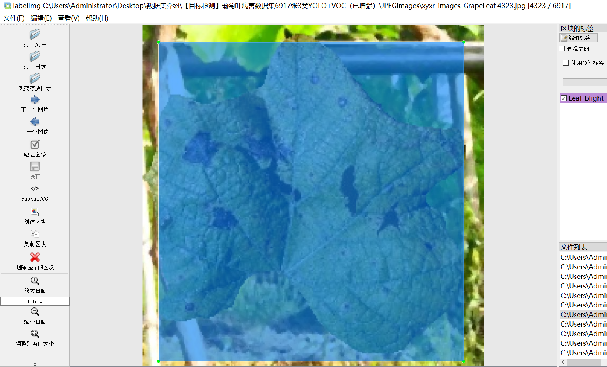
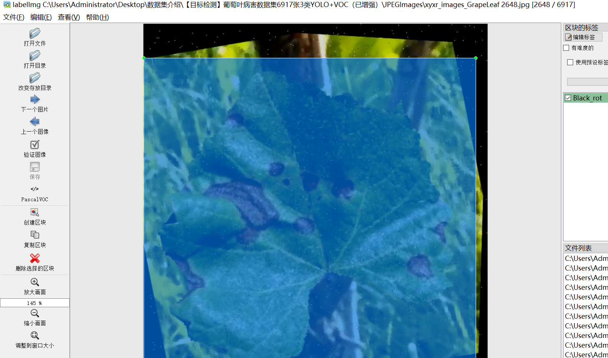
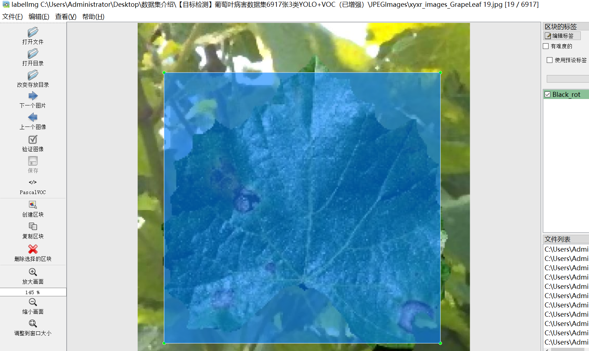
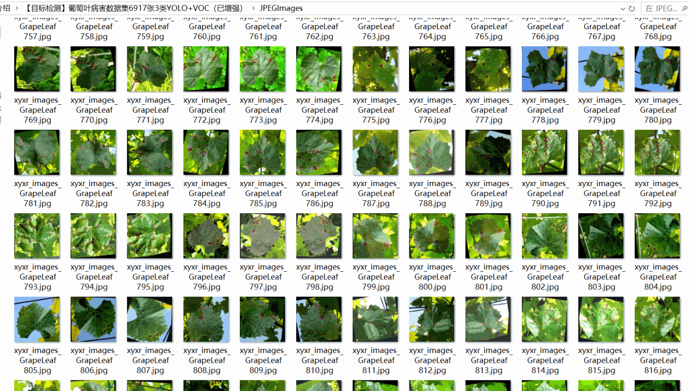

# [Object Detection] Grape Leaf Disease Dataset
6917 images, 3-class YOLO+VOC ((Augmented) )

The dataset format includes both VOC and YOLO formats. It consists of three folders within the zip file: JPEGImages, Annotations, and labels.

In the JPEGImages folder, there are a total of 6917 jpg images.

The Annotations folder contains a total of 6917 xml files.

The labels folder has a total of 6917 txt files.

There are a total of 3 categories in the labels: ["Black_rot", "Downey_mildew", "Leaf_blight"].

The number of boxes for each category is as follows:

- Black_rot boxes = 3228
- Downey_mildew boxes = 925
- Leaf_blight boxes = 2764

The total number of boxes is 6917.

The image resolution is clear with a pixel count.

The images have been enhanced, with between 3 to 10 enhancements per image or more.

The label shape is a rectangular box used for target detection recognition.

Important Note: No guarantee is made regarding the accuracy of the trained models or any weight files provided by this dataset. The data is intended to be accurate and reasonablely labeled.

Annotation Details:

## Images

---

Here is a pay link on Stripe (https://buy.stripe.com/3cs8yP7sY87d0vu9AB). Please contact me lonlonago@foxmail.com after funding $89, and I will send you a complete data files, thank you!

